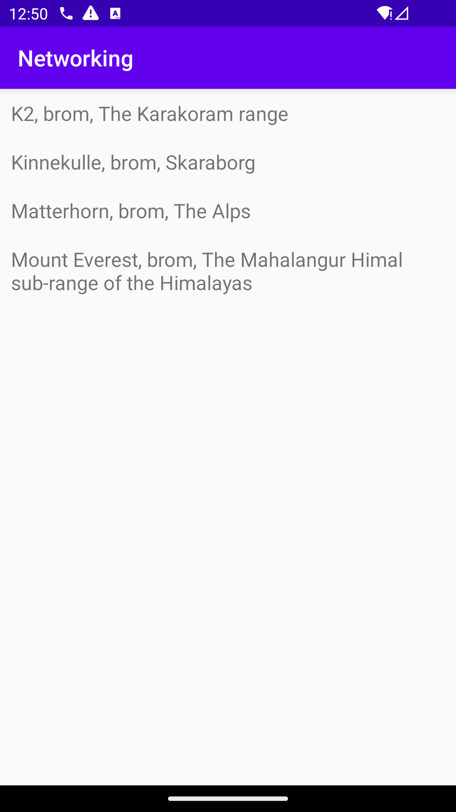
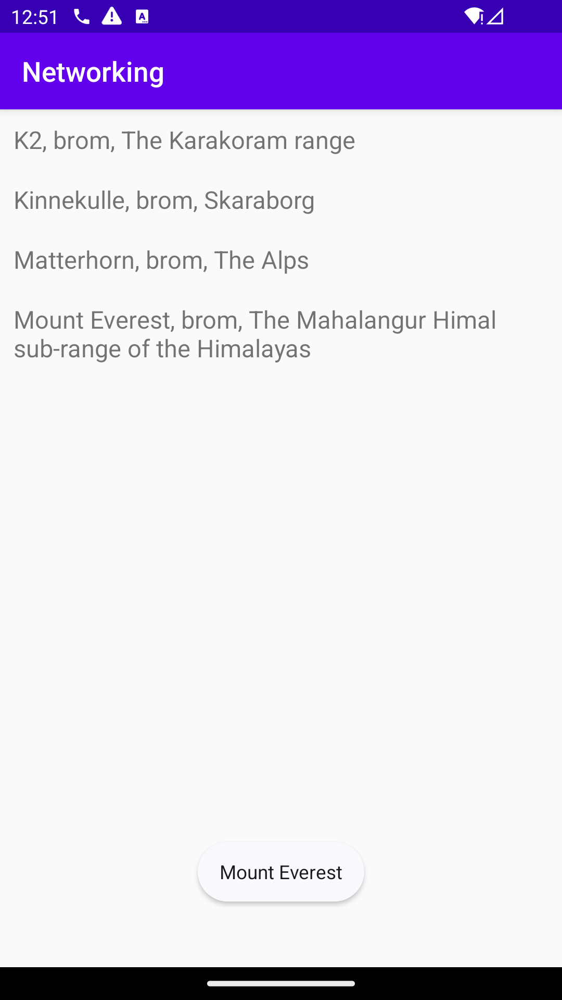
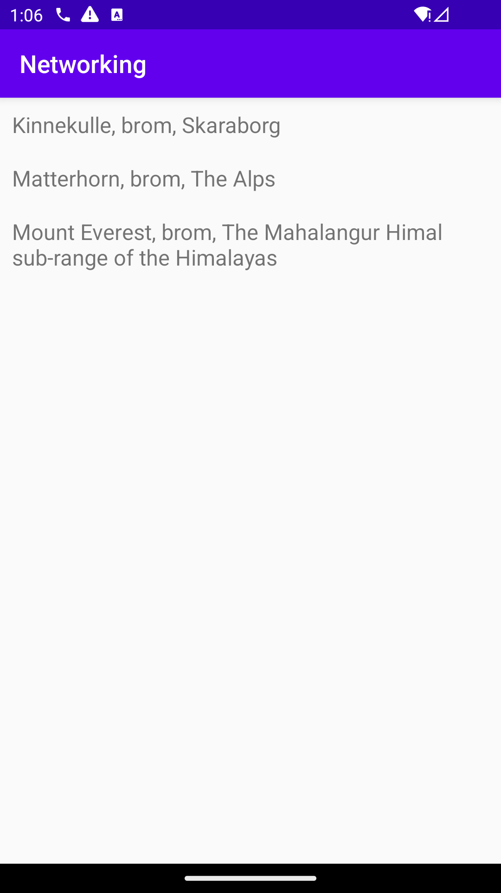

# Rapport

**Skriv din rapport här!**
Uppggiften gick ut på att skapa en layout i Android Studio genom att hämta data antingen från en URL 
eller via nätverkande. Trots vissa problem med internetanslutningen valde jag att använda en URL som 
datakälla, senare genomförde jag de följande steg för att skapa layouten. Jag anpassade layouten 
genom att inkludera RecyclerView. Därefter lade jag till en ArrayList för att lagra bergsdatan och 
en Adapter för att binda datan till RecyclerView för visningen. För att bergsobjekt skulle visas i 
listan skapade jag en ViewHolder-klass. Detta gjorde det möjligt att anpassa utseendet för varje vy 
i RecyclerView. För att hämta bergsdatan från JSON-källan skapade jag en separat klass som tog hand 
om all nätverk. Med hjälp av en JSONTask kunde jag hämta datan på rätt sätt.


Förklata kod:
Denna kods uppgfit är att öppna och läsa innehållet från en fil och skicka vidare dens innehåll 
för att användas i onPostExecute().
Först öppnas filen med hjälp av activity.getAssets().open(file). Sedan används en Scanner för att läsa 
innehållet från filen. Om filen har något innehåll i sig, skickas det vidare till metoden onPostExecute() 
genom en lyssnare (listener). Där kan datan sedan användas, men om något går fel under läsningen av filen, 
fångas felmeddelanden med hjälp av catch (IOException exception).
```
public void execute(String file) {
        try (InputStream stream = activity.getAssets().open(file)) {
            Scanner scanner = new Scanner(stream).useDelimiter("\\A");
            listener.onPostExecute(scanner.hasNext() ? scanner.next() : "");
        } catch (IOException exception) {
            Log.d("JsonFile", exception.getMessage());
        }
    }

}
```
Screenshot från JSON_URL:




Screenshot från JSON_FILE:



För och nackdelar:

Fördelar:
Denna uppgift var utmanande och krävde problemlösning för att hitta lösningarna. 
Trots svårigheterna fick jag värdefulla lärdomar och en ökad kunskap om datahantering 
och Android-utveckling, tack vare att jag hanterade problemen och anpassade mina lösningar. 

nackdelar:
Nackdelarna var att det var jobbigt när internetanslutningen strulade mycket eftersom det ledde
till förseningar i arbetet. Det gjorde att det tog längre tid och blev frustrerande. 
